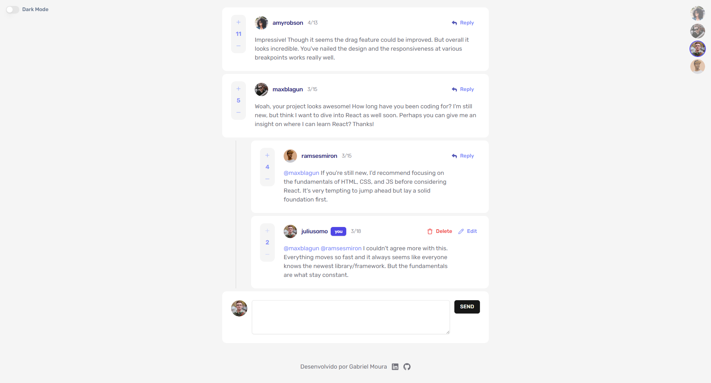

# Frontend Mentor - Interactive comments section solution

Minha solução para o desafio [Interactive comments section challenge on Frontend Mentor](https://www.frontendmentor.io/challenges/interactive-comments-section-iG1RugEG9).

### O desafio 🥷

Os usuários devem ser capazes de:

- Ver o layout ideal para a aplicação em função do tamanho da tela do seu dispositivo
- Ver os estados de hover de todos os elementos interativos da página
- Criar, ler, atualizar e apagar comentários e respostas
- Dar upvote e downvote nos comentários

**Os requisitos acima são os requisitos originais do desafio**

### Minhas implementações 💡

- Alteração entre tema claro e escuro
- Troca de usuários
- Persistência de todas as alterações feitas armazenando os dados no localStorage

### Screenshot

### Links

- Repositório: [https://github.com/gbmouraa/comments_section_frontendMentor](https://github.com/gbmouraa/comments_section_frontendMentor)
- Site: [https://comments-section-gm-dev.vercel.app/](https://comments-section-gm-dev.vercel.app/)

### Tecnologias utilizadas 💻

- Vite
- React
- Typescript
- Tailwind
- Framer Motion
- Gerenciamento de estado usando o context-api

### 🙋 Autor

- **Portfólio:**  [Gabriel Moura Dev](https://portfolio-gabrieldev.vercel.app/)
- **Linkedin:**  [Gabriel Moura](https://www.linkedin.com/in/gabriel-moura-b63382161/)

**Obs: considere que o projeto está na versão beta, irei fazer vários ajustes para melhorar a performance**
